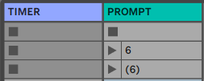

# Tesser_prompt

This M4L device displays dialogs with prompts to the performer.

---

## Usage

Place the device `tesser_prompt` in your Live set. If you want to time the prompts, you need to direct the output of the M4L device [`META_timer`](https://bitbucket.org/AdrianArtacho/meta_timer/src/master/). The timer device outputs the current time in *pseudonotes* as well as via two concurring CC messages (default `CC 88` abd `CC 89`). In order to listen to thee, set the CC input channels accordingly.

### Interface

- The *timer:* menu sets the source for the timing info. Default: CC input.

- The time display on the right also resets the timer to 00:00

- The main number on the left-hand side describes the prompt currently loaded, itc characteristics (timed/confirm, popup/propmter) and the time (E.g. 00:05) or scene (E.g. 6) where this promp should be displayed.

- Clicking on the button on the right launches it (for testing purposes)

---

### Commands sheet

The device uses the `download-sheet` object, which reads the .tsv values from a google spreadsheet living in the cloud (which it stores within the set). The URL to that .tsv sheet should be set accordingly.

---

### Clips

You may launch a prompt writing its number on the clip name, or preload it by writing the number between parenthesis.

---

### Display modes

You can choose between:

> **popup** 
> 
> **prompter**

and in each case time the dialog (E.g. 2.3 seconds) or requst for the user to click `close`.

---

### Debugging

For debugging purposes, you may click on the *< >* area on the GUI. RThis will show the maxwindow. In the settings, there are also a few gates to print different streams within the device.

### To-Do

- Trigering a prompt based on Scene number
- Hide the prompt title
- Save the dialog position with the set
- keep the dialog floating on top of all the other windows